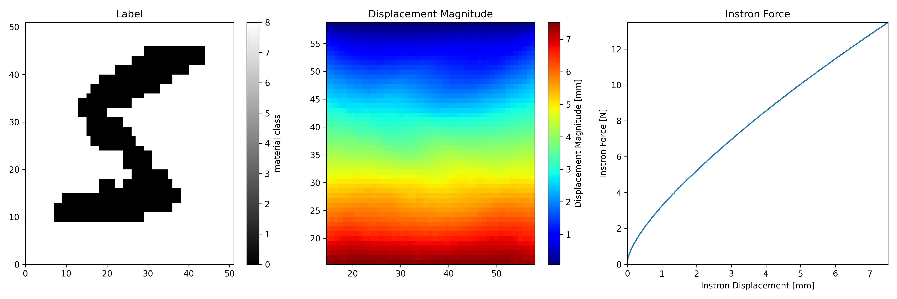

# Mechanical MNIST Challenge Data


This repository contains the dataset for the Mechanical MNIST Challenge. Check the official website for more information: [Mechanical MNIST Challenge](https://www.manuelrausch.com/mnist-challenge)


## Dataset Structure

At this stage, we are providing the training set, which consists of 90 tests. Each test is a uniaxial tensile test on a sample made of a specific material. The dataset is structured as follows:

```training-set/
    ├── 000.npz
    ├── 001.npz
    ├── ...
    └── 089.npz
```

Each test (from 000 to 089) is saved in a `.npz` file, which can be read using the python library `numpy` with the following command:

```python
import numpy as np

test_number = 0

data = np.load('training-set/%03d.npz' % test_number)

X = data['DIC_X']
disp = data['DIC_disp']
instron_disp = data['instron_disp']
instron_force = data['instron_force']
```

These arrays store the following data:

- `X`: Stores the location where the displacements are computed, in [mm]. Shape: [Nx, Ny, 2], where Nx and Ny are the size of the image captured, which may vary between tests. Note that this file also determines the orientation of the displacement arrays, and it needs to be considered to match the orientation of the label array.
- `disp`: are the displacements in [mm] recovered from DIC for each pixel, for each time step. Shape: [number of time steps, Nx, Ny, 2]
- `instron_disp`: stores the displacements applied by the uniaxial testing machine to the sample in [mm] for each time step. Shape: [number of time steps,]
- `instron_force`: stores the forces measured by the uniaxial testing machine for the displacements `instron_disp` in [N]. Shape: [number of time steps,]
- `label`: Stores the material class labels for each pixel. Shape: [Nx, Ny]


This plot is generated with [read_data.py](read_data.py):



