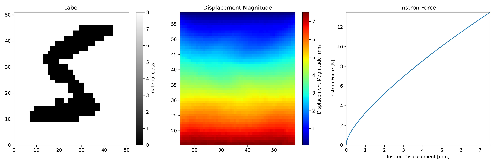

# Mechanical MNIST Challenge Data


This repository contains the dataset for the Mechanical MNIST Challenge. Check the official website for more information: [Mechanical MNIST Challenge](https://www.manuelrausch.com/mnist-challenge)


## Dataset Structure

At this stage, we are providing the training set, which consists of 90 tests. Each test is a uniaxial tensile test on a sample made of a specific material. The dataset is structured as follows:

```training-set/
    ├── 000.npz
    ├── 001.npz
    ├── ...
    └── 089.npz
```

Each test (from 000 to 089) is saved in a `.npz` file, which can be read using the python library `numpy` with the following command:

```python
import numpy as np

test_number = 0

data = np.load('training-set/%03d.npz' % test_number)

X = data['DIC_X']
disp = data['DIC_disp']
instron_disp = data['instron_disp']
instron_force = data['instron_force']
```

These arrays store the following data:

- `X`: Stores the location where the displacements are computed, in [mm]. Shape: [Nx, Ny, 2], where Nx and Ny are the size of the image captured, which may vary between tests. Note that this file also determines the orientation of the displacement arrays, and it needs to be considered to match the orientation of the label array.
- `disp`: are the displacements in [mm] recovered from DIC for each pixel, for each time step. Shape: [number of time steps, Nx, Ny, 2]
- `instron_disp`: stores the displacements applied by the uniaxial testing machine to the sample in [mm] for each time step. Shape: [number of time steps,]
- `instron_force`: stores the forces measured by the uniaxial testing machine for the displacements `instron_disp` in [N]. Shape: [number of time steps,]
- `label`: Stores the material class labels for each pixel. Shape: [Nx, Ny]


This plot is generated with [read_data.py](read_data.py):




## Evaluation Metrics

The evaluation metrics used for the forward and inverse models are located in the files `evaluate_forward.py` and `evaluate_inverse.py`, respectively. These scripts can be used to compute the metrics for model predictions against the ground truth data.

## Docker Model Testing

The repository includes Dockerized versions of both forward and inverse models for easy testing and deployment.
Edit the Dockerfiles located in the `Docker/forward/` and `Docker/inverse/` directories to customize the models as needed.
Also, you need to implement your model logic in the `run_model_*_docker.py` scripts in the respective directories.


### Building Docker Images

Build the forward and inverse model images:

```bash
# Build forward model image
docker build -t mechanical-mnist-forward:latest Docker/forward/

# Build inverse model image
docker build -t mechanical-mnist-inverse:latest Docker/inverse/
```

### Testing the Forward Model

The forward model predicts displacement fields and forces from material labels and instron displacement:

```bash
# Run forward model on a sample file
docker run --rm -v $PWD:/data mechanical-mnist-forward:latest /data/training-set/000.npz

# Run with output file
docker run --rm -v $PWD:/data mechanical-mnist-forward:latest /data/training-set/000.npz --output /data/output_forward.npz
```

### Testing the Inverse Model

The inverse model predicts material labels from displacement and force data:

```bash
# Run inverse model on a sample file
docker run --rm -v $PWD:/data mechanical-mnist-inverse:latest /data/training-set/000.npz

# Run with output file
docker run --rm -v $PWD:/data mechanical-mnist-inverse:latest /data/training-set/000.npz --output /data/output_inverse.npz
```

### View Help Messages

```bash
# Forward model help
docker run --rm mechanical-mnist-forward:latest --help

# Inverse model help
docker run --rm mechanical-mnist-inverse:latest --help
```

### Batch Testing

Test models on multiple files:

```bash
# Test forward model on first 3 files
for i in {0..2}; do
  docker run --rm -v $PWD:/data mechanical-mnist-forward:latest /data/training-set/$(printf "%03d" $i).npz
done
```

**Note:** The `--rm` flag automatically removes the container after it exits, and `-v $PWD:/data` mounts the current directory to `/data` inside the container. If using Podman instead of Docker, simply replace `docker` with `podman` in all commands above.

